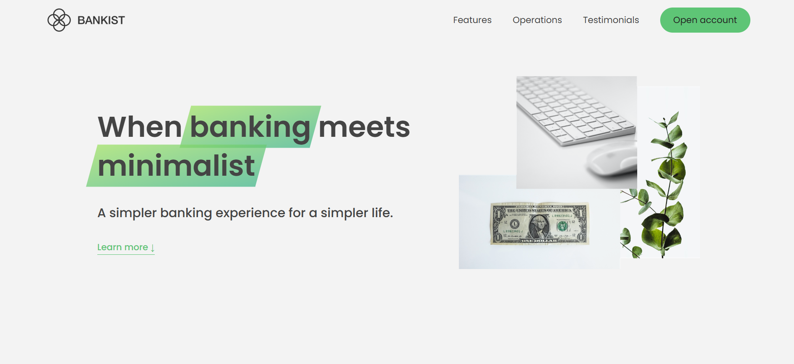

# 🏦 Bankist Website

An interactive **banking landing page** built as part of [Jonas Schmedtmann's JavaScript course](https://www.udemy.com/course/the-complete-javascript-course/).  
The project focuses on modern DOM manipulation, scroll-based animations, and performance techniques — with a responsive layout for all screen sizes.

---

## ✨ Features

- Sticky navigation using **Intersection Observer API**
- Smooth scrolling navigation links
- Tabbed component for switching content
- Section reveal animations on scroll
- Lazy loading images for better performance
- Responsive design for mobile and tablet screens

---

## 🧠 What I Worked On

- Implemented **all the JavaScript functionality**  
  (sticky nav, tabbed component, smooth scroll, section reveal, lazy images)
- Made the entire website **fully responsive**
- Improved the user experience on mobile screens

---

## 🛠️ Technologies Used

- **HTML5** (provided starter)
- **CSS3** (responsive edits)
- **JavaScript (ES6+)**

---

## 🚀 Live Demo

🔗 [View Live Site](https://vercel.com/nouransherifs-projects/bankist-website)

---

## 🧩 Lessons Learned

- How to use the **Intersection Observer API**
- How to optimize websites with **lazy loading**
- Best practices for smooth scrolling and sticky elements
- Responsive layout adjustments using media queries and JavaScript

---

## 📂 Project Structure
├── index.html
├── style.css
├── script.js
└── images/

---

### 🧡 Credits

Design and starter files by **Jonas Schmedtmann**  

